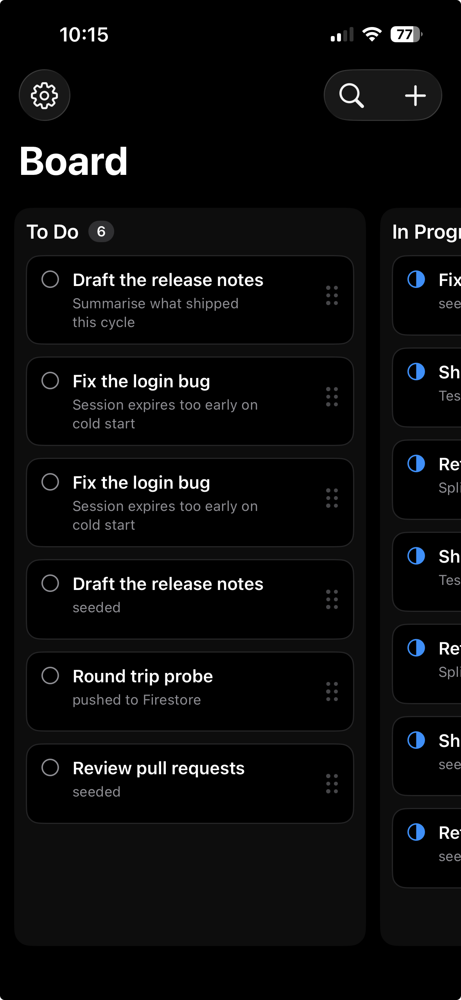
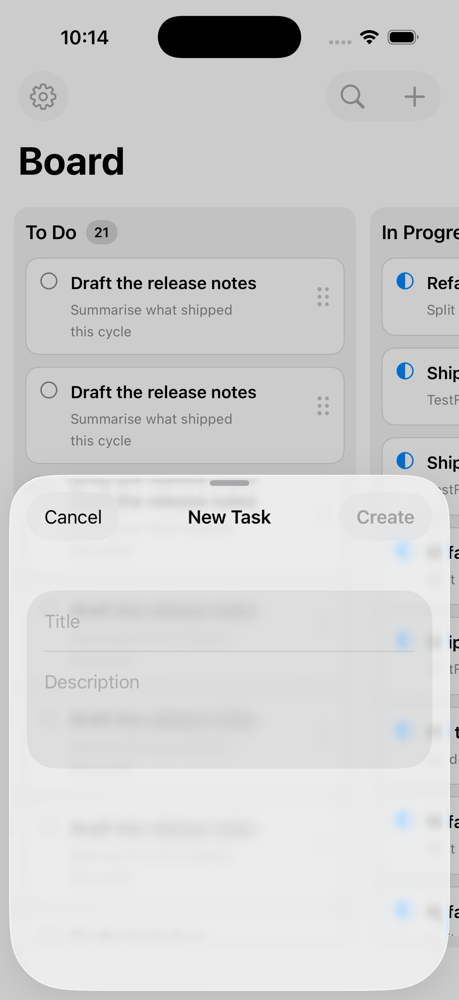
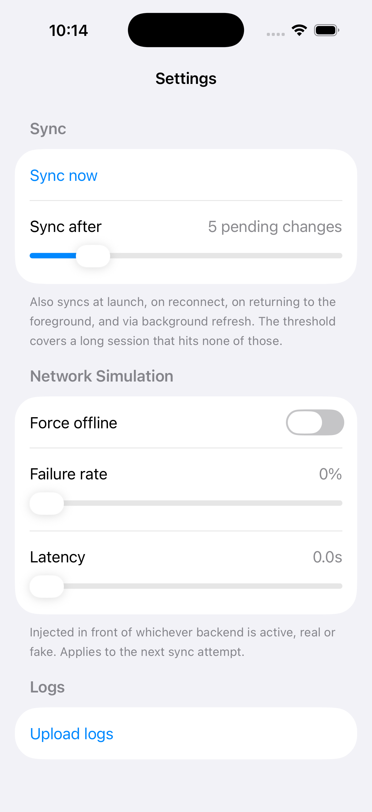
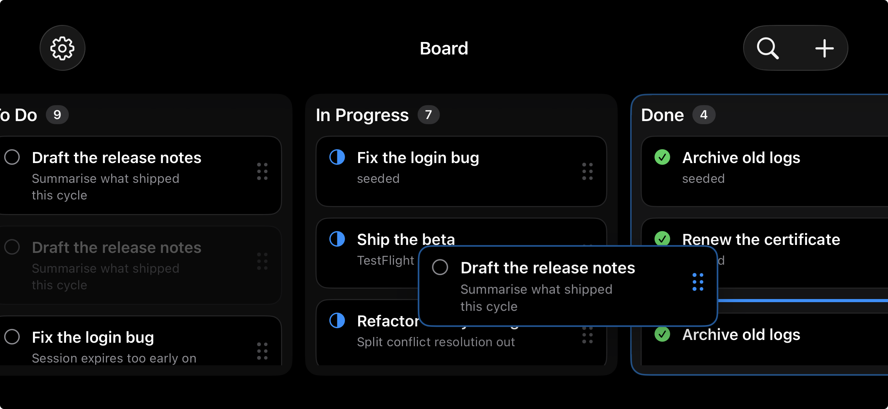

# Offline-First Task Board

A task board with three columns — To Do, In Progress, Done — built to stay fully usable without a network connection and sync changes once one is available.

## Screenshots

| Board | New task | Settings |
| --- | --- | --- |
|  |  |  |

Dragging a card between columns. The original stays in place, dimmed, so the column keeps its header count until the drop commits; a copy follows the finger, and a bar in the target column marks where it will land.



## Setup

Requires Xcode 26 or newer, iOS 17 or newer. Open `TaskBoard.xcodeproj`, build, and run — no configuration needed, the app ships with an in-memory fake backend.

### Optional: Firebase

1. Register an iOS app in the Firebase console using this project's bundle identifier.
2. Add `GoogleService-Info.plist` to `TaskBoard/`, the folder holding `TaskBoardApp.swift`. The file is gitignored; without it the app uses the fake backend.
3. **File → Add Package Dependencies…** → `https://github.com/firebase/firebase-ios-sdk`. Add `FirebaseCore`, `FirebaseFirestore`, `FirebaseStorage`, and `FirebaseCrashlytics` to the TaskBoard target.
4. Enable Firestore (Build → Firestore Database → Create database) and replace the default deny-all rules:

   ```
   rules_version = '2';

   service cloud.firestore {
     match /databases/{database}/documents {
       match /tasks/{taskId} {
         allow read, write: if true;
       }
       match /archivedTasks/{taskId} {
         allow read, write: if true;
       }
     }
   }
   ```

   Both collections need a rule. Firestore denies anything a `match` block
   doesn't name, so leaving `archivedTasks` out fails the pull — and it fails
   the whole sync, since the archive is fetched alongside the board.

   Log upload uses Storage, which has its own ruleset:

   ```
   rules_version = '2';

   service firebase.storage {
     match /b/{bucket}/o {
       match /logs/{logFile} {
         allow read, write: if true;
       }
     }
   }
   ```

   There's no authentication, so these leave the data open to anyone holding the project config — which ships inside the app bundle. Fine for a demo, wrong for anything else.

## Architecture

- **Features** — one folder per screen (Board, TaskForm, Settings), each holding its View and ViewModel.
- **Services** — `Task` (split into `Model` for domain types and the repository protocol, `Persistence` for Core Data, with `TaskUseCases` above both), `Sync` (engine, remote protocol, implementations), `Logging` (logger, log upload, crash reporting).
- **Support** — cross-cutting utilities like the network monitor.
- **Components** — UI shared across features, like the status banner.

ViewModels call `TaskUseCases`, which calls a `TaskRepository` protocol; the concrete implementation is the only thing that knows about Core Data. Not full Clean Architecture with a routing layer and per-verb use case types — for three screens that would be ceremony. The boundary enforced strictly is that nothing in `Model` imports CoreData, which is what keeps the tests running without a database.

## Assumptions

- No authentication or user accounts — not mentioned in the assignment, and a single-user board doesn't need them.
- 2MB per log generation is a reasonable default for a debug log on a phone. It's one constant if that needs changing.
- Last-write-wins is an acceptable default. Multi-device conflicts are only reachable through the optional Firestore path, and field-level merging was out of scope either way.

## Technical decisions

**Core Data over SwiftData.** More shipping experience with it, and its background-context and merge-policy behaviour is better understood — which matters when a sync engine writes from a background actor while the UI reads on the main thread.

**Outbox pattern.** Every create, update, move, and delete writes locally and appends a queue entry in the same transaction. There's no separate offline path: the app always writes locally first, and being offline just means the push waits.

**Fractional-index positions.** Cards store a `Double`, so reordering computes one value between two neighbours instead of rewriting every row below.

**Last-write-wins.** Each queued edit captures the task's `updatedAt` before the change. On sync, that base version is compared against the server's; if the server moved on, the newer `updatedAt` wins. Field-level merging was out of scope.

**Two backends, chosen at runtime.** A fake in-memory service by default so the app runs with zero configuration; Firestore when `GoogleService-Info.plist` is in the bundle. The check is at runtime rather than `#if canImport`, because once the SDK is a dependency `canImport` is always true and can no longer distinguish a configured project from an unconfigured one.

**Fault injection wraps the backend.** `SimulatedFaultsRemoteService` decorates whichever service is active, so forced-offline, latency, and failure injection work against Firestore too. Keeping them inside the fake meant configuring a real backend silently removed the only way to exercise the offline queue.

**Deletes are tombstones.** A deleted task keeps its row with `deletedAt` set, locally and remotely. Hard-deleting the remote document would make the deletion invisible to other devices — an absent record is indistinguishable from one never seen, and any queued edit would recreate it.

**Five sync triggers**: launch, foreground, reconnect, background refresh, and the outbox crossing a configurable depth. The last exists because the other four depend on the app changing state, which a long foreground session never does. Overlapping syncs are dropped, and the depth trigger watches the outbox rather than the task list — a failed push writes to the task, so watching tasks would retry in a loop.

**Two-generation log rotation.** `current.log` becomes `previous.log` at the size cap and a fresh file starts, bounding disk usage permanently without a cleanup pass.

## AI tools used

I used Claude as a design partner throughout — working through Core Data vs. SwiftData, the outbox and sync design, and conflict resolution, and catching where a suggested pattern was over-engineered for this scope (a use case type per CRUD verb) or under-specified. The decisions above are mine and I can walk through the reasoning behind each.

Implementation was carried out with Claude Code from scoped specifications I wrote alongside it, each constrained by rules I set on architecture and scope: the agreed folder layout, one use case type rather than one per verb, Core Data not SwiftData, no unreviewed commits. I reviewed the generated code against those specs and tested it — offline behaviour, conflict resolution, reorder edge cases — before moving on, and made the call on anything ambiguous.

The unit tests and their mocks were written by Claude Code against test cases I specified; I reviewed them rather than hand-writing them. Every piece of implementation follows a decision made before the code was written, and every commit in this history was reviewed and made by me, not the agent.

## Time spent

Around 10 hours:

| Area | Time |
| --- | --- |
| Domain models, Core Data, outbox | 1.25h |
| Sync engine, conflict resolution, timeouts | 1.25h |
| Connectivity and status banner | 0.5h |
| Board: cards, drag and drop, empty state | 1.75h |
| Task create/edit sheet | 0.5h |
| Board search | 0.75h |
| Logging, crash reporting, settings | 1h |
| Firebase: Firestore, Crashlytics, rules | 1.5h |
| Concurrency and threading pass | 0.5h |
| Unit tests | 0.5h |
| Screenshots, README, final pass | 0.5h |

## Known limitations

- **Whole-record conflict resolution.** Two offline edits to different fields of one task still have one overwrite the other.
- **Client clocks decide the winner.** `updatedAt` is written by the device, so skewed clocks resolve wrongly and the fast one always wins. Server timestamps would fix it, but the base-version check needs the value locally at write time.
- **Tombstones are never purged.** Deleted tasks accumulate locally and in Firestore. Correct for propagation, unbounded over time.
- **No authentication.** The rules above leave data open to anyone with the project config.
- **No per-card sync indicator.** It was removed because a green tick for "synced" read as "done". Sync state now shows only in the status banner, so a single task stuck in `.failed` isn't surfaced.
- **No pagination.** The board is expected to hold a modest number of cards.
- **No UI tests, and Core Data is untested.** Tests run entirely against in-memory mocks, so the managed-object mapping and merge policy are exercised only by running the app.
